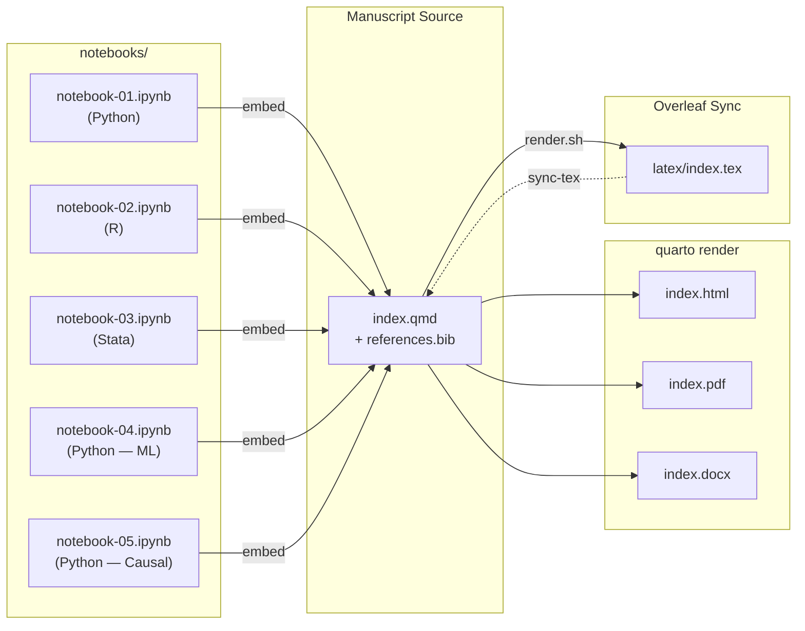
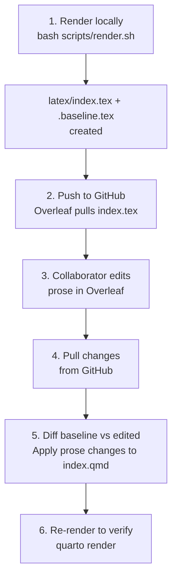

# Computational Notebooks in Python, R, and Stata

> A multi-language guide to data science workflows — built with [Quarto](https://quarto.org/).

This project demonstrates how Jupyter-based computational notebooks support reproducible data science workflows across Python, R, and Stata. Five companion notebooks cover exploratory data analysis, machine learning (Random Forest regression), and causal inference (Double Machine Learning), using data from the [DS4Bolivia](https://github.com/quarcs-lab/ds4bolivia) repository covering Bolivia's 339 municipalities.

**Live manuscript:** <https://cmg777.github.io/claude4data/>

## Quick Start

```bash
# 1. Clone and enter the project
git clone https://github.com/cmg777/claude4data.git
cd claude4data

# 2. Install Python dependencies
uv sync

# 3. Execute the notebooks
uv run jupyter execute --inplace notebooks/notebook-01.ipynb
uv run jupyter execute --inplace notebooks/notebook-04.ipynb

# 4. Run the standalone scripts
uv run python code/ml_intro_rf.py
uv run python code/tut_doubleml.py

# 5. Render the manuscript (HTML + PDF + Word)
quarto render

# 6. View the output
open _manuscript/index.html
```

> R and Stata kernels require additional setup — see [Installation](#installation) below.

---

## How It Works

Notebooks produce labeled figures and tables, the manuscript embeds them, and Quarto renders everything into final outputs. Collaborators who prefer LaTeX can edit via Overleaf, and their changes sync back into the Quarto source.



---

## Notebooks

| Notebook | Language | Description | Colab |
| -------- | -------- | ----------- | ----- |
| [notebook-01](notebooks/notebook-01.ipynb) | Python | Sample data exploration — synthetic regional indicators | [](https://colab.research.google.com/github/cmg777/claude4data/blob/master/notebooks/notebook-01.ipynb) |
| [notebook-02](notebooks/notebook-02.ipynb) | R | Sample R analysis — mirrors notebook-01 in R | [](https://colab.research.google.com/github/cmg777/claude4data/blob/master/notebooks/notebook-02.ipynb) |
| [notebook-03](notebooks/notebook-03.ipynb) | Stata | Sample Stata analysis — mirrors notebook-01 in Stata | — |
| [notebook-04](notebooks/notebook-04.ipynb) | Python | Introduction to Machine Learning — Random Forest Regression | [](https://colab.research.google.com/github/cmg777/claude4data/blob/master/notebooks/notebook-04.ipynb) |
| [notebook-05](notebooks/notebook-05.ipynb) | Python | Introduction to Causal Inference — Double Machine Learning | [](https://colab.research.google.com/github/cmg777/claude4data/blob/master/notebooks/notebook-05.ipynb) |

All notebooks are paired with `.md:myst` files via [Jupytext](https://jupytext.readthedocs.io/) for clean version control. Python and R notebooks include Colab-aware setup cells that automatically clone the repository when running in Google Colab.

---

## Data

All data comes from the [DS4Bolivia](https://github.com/quarcs-lab/ds4bolivia) repository, which provides standardized datasets for studying Bolivian development.

| Dataset | Source Path | Key Columns |
| ------- | ----------- | ----------- |
| SDG indices | `/sdg/sdg.csv` | `asdf_id`, `imds`, `sdg1`–`sdg15` |
| Satellite embeddings | `/satelliteEmbeddings/satelliteEmbeddings2017.csv` | `asdf_id`, `A00`–`A63` |
| Region names | `/regionNames/regionNames.csv` | `asdf_id`, municipality/department names |

- **Join key:** `asdf_id` (unique identifier for each of Bolivia's 339 municipalities)
- **Target variable:** `imds` (Municipal Sustainable Development Index, 0–100 scale)
- **Features:** `A00`–`A63` (64 satellite embedding dimensions from 2017 imagery)
- **Local cache:** `data/rawData/ds4bolivia_merged.csv` (auto-downloaded on first run)

---

## Requirements

| Tool | Purpose | Required? |
| ---- | ------- | --------- |
| [Quarto](https://quarto.org/) >= 1.4 | Manuscript rendering | Yes |
| [uv](https://docs.astral.sh/uv/) | Python package manager | Yes |
| Python 3.12+ | Notebooks, scripting | Yes |
| R | R notebooks | If using R |
| Stata | Stata notebooks | If using Stata |

Verify your setup (all commands should return version numbers):

```bash
quarto --version        # >= 1.4
uv --version            # any recent version
python3 --version       # >= 3.12
R --version             # optional, for R notebooks
stata -v                # optional, for Stata notebooks
```

---

## Installation

### Python Environment

```bash
# Create virtual environment and install all dependencies
uv sync

# The Python Jupyter kernel is installed automatically
```

This creates a `.venv/` with locked dependencies from `uv.lock`. All Python commands should be prefixed with `uv run` to use this environment (e.g., `uv run jupyter notebook`).

### R Kernel (IRkernel)

```bash
R -e "install.packages(c('IRkernel', 'ggplot2', 'knitr'), repos='https://cloud.r-project.org')"
R -e "IRkernel::installspec()"
```

Verify: `jupyter kernelspec list` should show `ir`.

### Stata Kernel (nbstata)

> **Important:** Use **nbstata**, not the legacy `stata_kernel` (which has a graph-capture bug).

```bash
# nbstata is already in pyproject.toml — uv sync installs it
# Just register the Jupyter kernel:
uv run python -m nbstata.install
```

Then create the configuration file at `~/.config/nbstata/nbstata.conf`:

```ini
[nbstata]
stata_dir = /Applications/Stata
edition = se
```

Adjust `stata_dir` and `edition` for your OS and Stata version (`be`, `se`, or `mp`). See [notebooks/README.md](notebooks/README.md) for platform-specific paths.

Verify: `jupyter kernelspec list` should show `nbstata`.

### Installing Packages

**Python** — managed by `uv`, which keeps `pyproject.toml` and `uv.lock` in sync:

```bash
uv add numpy pandas          # Add packages (updates pyproject.toml + uv.lock)
uv remove pandas             # Remove a package
uv sync                      # Reinstall from lockfile (e.g., after pulling)
```

Never use `pip install` directly — it bypasses the lockfile.

**R** — use `install.packages()` from an R session:

```r
install.packages(c("dplyr", "tidyr"), repos = "https://cloud.r-project.org")
```

**Stata** — packages are installed via `ssc install` or `net install` from within a Stata session or notebook cell:

```stata
ssc install estout
ssc install reghdfe
```

---

## Manuscript Workflow

### Writing

The manuscript lives in `index.qmd`. It uses standard Markdown with Quarto extensions:

- **Sections** with cross-reference IDs: `## Introduction {#sec-introduction}`
- **Citations** from `references.bib`: `@key` (narrative) or `[@key]` (parenthetical)
- **Embedded outputs** from notebooks: ``

You write prose in `index.qmd` and keep computational work in the notebooks. The embed shortcodes pull figures and tables from notebooks into the manuscript at render time.

### Rendering

```bash
# Render all formats (HTML, PDF, Word) → outputs in _manuscript/
quarto render

# Render a single format
quarto render index.qmd --to html
quarto render index.qmd --to pdf
quarto render index.qmd --to docx

# Clean render (clears all caches first, also stages LaTeX for Overleaf)
bash scripts/render.sh
```

The clean render script (`scripts/render.sh`) removes `_freeze/`, `_manuscript/`, and `.quarto/` before rendering, ensuring a fresh build. It also copies the generated LaTeX to `latex/` for the Overleaf workflow.

---

## Notebook Workflow

### Creating Notebooks

Notebooks follow sequential naming: `notebook-01.ipynb`, `notebook-02.ipynb`, etc. Each notebook is paired with a `.md:myst` file via [Jupytext](https://jupytext.readthedocs.io/) — the `.ipynb` is for execution, and the `.md` is for version control (clean diffs in git).

To create a new notebook manually:

1. Create the `.ipynb` with the appropriate kernel (Python, R, or Stata)
2. Add a setup cell that loads the reproducibility config (see [Reproducibility](#reproducibility))
3. Pair it with Jupytext: `uv run jupytext --set-formats ipynb,md:myst notebooks/notebook-NN.ipynb`
4. Register it in `_quarto.yml` under `manuscript.notebooks`

### Executing Notebooks

Notebooks must be executed before rendering the manuscript (so their outputs are available for embedding):

```bash
# Execute a notebook (--inplace is required to save outputs back to the file)
uv run jupyter execute --inplace notebooks/notebook-01.ipynb

# After editing the .ipynb interactively, sync the .md pair
uv run jupytext --sync notebooks/notebook-01.ipynb

# After editing the .md file directly, sync the .ipynb pair
uv run jupytext --sync notebooks/notebook-01.md
```

> **Important:** The `--inplace` flag is required for `jupyter execute`. Without it, outputs are discarded.

### Embedding Outputs in the Manuscript

To embed a figure or table from a notebook into `index.qmd`, you need two things:

**1. A labeled cell in the notebook:**

For Python or R cells, use the `#|` (hash-pipe) prefix:

```python
#| label: fig-my-plot
#| fig-cap: "Descriptive caption for the figure"
import matplotlib.pyplot as plt
plt.plot(x, y)
plt.show()
```

For Stata cells, use the `*|` (star-pipe) prefix (because `*` is Stata's comment character):

```stata
*| label: fig-stata-scatter
*| fig-cap: "Stata scatter plot"
twoway scatter y x
```

> **Stata restriction:** Do NOT use the `tbl-` label prefix for Stata cells that produce text output. It triggers Quarto's table parser and crashes. Use a plain label instead (e.g., `stata-summary`).

**2. An embed shortcode in `index.qmd`:**

```markdown

```

The label after `#` must match the cell label exactly.

---

## Google Colab

Python and R notebooks include Colab badges and auto-setup cells. When opened in Colab, they automatically clone the repository so that `config.py` / `config.R` and project paths are available.

**Python detection:**

```python
import sys
if "google.colab" in sys.modules:
    !git clone --depth 1 https://github.com/cmg777/claude4data.git /content/claude4data 2>/dev/null || true
    %cd /content/claude4data/notebooks
```

**R detection:**

```r
if (dir.exists("/content")) {
    system("git clone --depth 1 https://github.com/cmg777/claude4data.git /content/claude4data 2>/dev/null || true")
    setwd("/content/claude4data/notebooks")
}
```

> **Note:** R notebooks require Colab's R runtime (Runtime > Change runtime type > R). Stata notebooks are not supported in Colab.

---

## Overleaf Collaboration

For collaborators who prefer editing in LaTeX, the project supports a sync workflow with [Overleaf](https://www.overleaf.com/) via GitHub integration.

### Workflow Overview



### Constraints

- **Prose only** — Only text edits in the manuscript body are transferred. `` shortcodes are preserved exactly as-is.
- **Captions are not synced** — Figure and table captions live in notebook cells and cannot be recovered from the compiled LaTeX.
- **Preamble is ignored** — Everything before `\begin{document}` is auto-generated by Quarto.
- **Baseline is local** — `latex/.baseline.tex` is gitignored. Each collaborator diffs against their own last render.

---

## Reproducibility

### Seeds and Configuration

Every notebook should call `set_seeds()` in its first cell to ensure reproducible results:

**Python:**

```python
import sys
sys.path.insert(0, "..")
from config import set_seeds, DATA_DIR, IMAGES_DIR
set_seeds()  # sets random, numpy, and PYTHONHASHSEED to 42
```

**R:**

```r
source("../config.R")
set_seeds()  # sets seed to 42 with L'Ecuyer-CMRG RNG
```

**Stata:**

```stata
clear all
set seed 42
```

The configuration files (`config.py` and `config.R`) also provide standardized project paths (`DATA_DIR`, `RAW_DATA_DIR`, `IMAGES_DIR`, `TABLES_DIR`, etc.) resolved dynamically from the project root — no hardcoded paths.

### Dependencies

Python dependencies are locked via `uv` (`pyproject.toml` + `uv.lock`), R packages use the system library (or `renv` for isolation), and Stata packages are installed into the system `ado/` directory. See [Installing Packages](#installing-packages) for commands.

### Credentials

API keys and secrets go in `.env` (gitignored). Never store secrets anywhere else.

---

## References and Citations

References are managed with [Zotero](https://www.zotero.org/) and exported to `references.bib` at the project root.

In `index.qmd`, cite with standard Pandoc syntax:

```markdown
As shown by @key            # narrative: "As shown by Author (2024)"
As shown in the data [@key] # parenthetical: "As shown in the data (Author, 2024)"
```

Annotation notes on papers can be stored as Markdown files in `references/`.

---

## Project Structure

### Directories

| Directory | Purpose | Key Contents |
| --------- | ------- | ------------ |
| `notebooks/` | Computational notebooks | `.ipynb` + `.md:myst` pairs (Python, R, Stata). Outputs are embedded in the manuscript via ``. See [notebooks/README.md](notebooks/README.md). |
| `data/` | Processed datasets | Transformed data produced by notebooks or scripts. |
| `data/rawData/` | Raw source data | **Never modify these files.** Contains `ds4bolivia_merged.csv` (339 municipalities). |
| `code/` | Standalone scripts | `ml_intro_rf.py` — Random Forest regression; `tut_doubleml.py` — DoubleML causal inference. |
| `images/` | Figures and plots | 7 ML figures (`ml_*.png`), 4 DoubleML figures (`tut_doubleml_*.png`). |
| `tables/` | Output tables | `ml_rf_results.csv`, `ml_rf_best_params.csv`, `tut_doubleml_results.csv`. |
| `latex/` | Overleaf sync staging | `index.tex` (tracked, shared with Overleaf) + `.baseline.tex` (gitignored, for diffing). |
| `slides/` | Quarto presentations | Revealjs slide decks. See [slides/README.md](slides/README.md). |
| `references/` | Annotated bibliography | Markdown notes on papers cited in the project. |
| `notes/` | Research notes | Brainstorming, ideas, meeting notes. |
| `templates/` | LaTeX template | `chadManuscript/manuscript.tex` for standalone LaTeX use. |
| `scripts/` | Build utilities | `render.sh` — clean render pipeline with Overleaf staging. |
| `handoffs/` | Session logs | Timestamped Markdown reports (`YYYYMMDD_HHMM.md`) for cross-session continuity. |
| `legacy/` | Archived materials | Old versions of files moved here instead of being deleted. |
| `_manuscript/` | Rendered outputs | **Auto-generated**, tracked in git. Contains HTML, PDF, Word, and notebook preview pages. Deployed to GitHub Pages on push. |
| `.github/workflows/` | CI/CD | `deploy-pages.yml` — deploys `_manuscript/` to GitHub Pages on push to `master`. |
| `.claude/skills/` | Claude Code skills | `ml-intro` for ML tutorials; `data-science-tutorial` for general case-study tutorials. |

### Root-Level Files

| File | What It Does | When to Edit |
| ---- | ------------ | ------------ |
| `index.qmd` | Main manuscript source — prose, section structure, embed shortcodes, bibliography | When writing or editing the manuscript |
| `_quarto.yml` | Quarto project configuration — output formats, notebook registrations, render settings | When adding new notebooks or changing output settings |
| `references.bib` | BibTeX bibliography (exported from Zotero) | When adding or updating references |
| `pyproject.toml` | Python project metadata and dependencies | When adding Python packages (`uv add`) |
| `uv.lock` | Locked dependency versions (auto-generated by `uv`) | Never edit manually — updated by `uv sync` / `uv add` |
| `config.py` | Python reproducibility config — seed (42), project paths | Rarely — only if adding new path constants |
| `config.R` | R reproducibility config — seed (42), project paths | Rarely — only if adding new path constants |
| `jupytext.toml` | Jupytext config — strips `_sphinx_cell_id`, `execution`, and `vscode` metadata | Rarely — do not remove the `cell_metadata_filter` |
| `custom.scss` | Custom SCSS for notebook styling — badge alignment, code cell polish, hide `In [N]:` labels | When tweaking notebook page appearance |
| `rebuild-toc.html` | JavaScript that rebuilds truncated TOCs on notebook preview pages | Rarely — only if Quarto changes TOC generation |
| `.python-version` | Pins Python to 3.12 for `uv` | Only if upgrading Python |
| `.gitignore` | Git ignore rules | When adding new file types to exclude |
| `.env` | API keys and secrets (**gitignored**) | When adding credentials (never commit this file) |
| `CLAUDE.md` | Instructions for Claude Code AI assistant | When updating project context or AI workflow rules |

---

## Workflow with Claude Code

This project includes [Claude Code](https://claude.com/claude-code) integration for AI-assisted research workflows. The `CLAUDE.md` file provides project context and behavioral rules for the AI assistant.

### Available Skills

Skills are defined in [`.claude/skills/`](.claude/skills/). Type `/project:<name>` in Claude Code to invoke a skill.

| Skill | What It Does | Definition |
| ----- | ------------ | ---------- |
| `/project:ml-intro` | Create an introductory Random Forest ML workflow (script + notebook) predicting IMDS from satellite embeddings | [SKILL.md](.claude/skills/ml-intro/SKILL.md) |
| `/project:data-science-tutorial` | Create a pedagogical case-study tutorial (script + notebook) on any data science topic from user-provided references and dataset | [SKILL.md](.claude/skills/data-science-tutorial/SKILL.md) |

### Session Continuity

Handoff reports in `handoffs/` preserve context across sessions. Each report includes the project state, work completed, decisions made, and next steps. Claude reads the most recent handoff at the start of every session to pick up where the last session left off.
