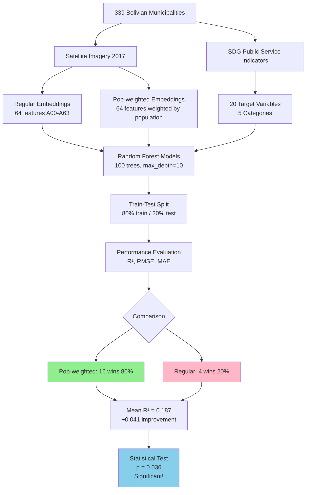
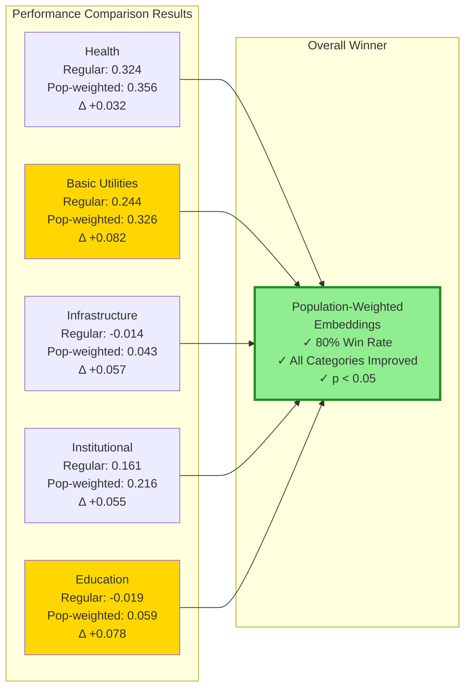
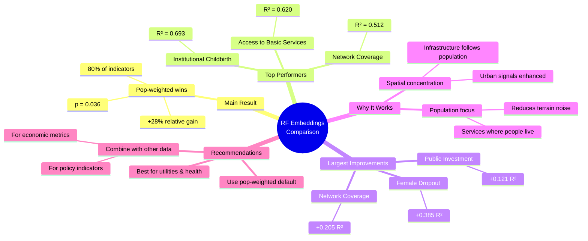

# Comparative Analysis: Regular vs Population-Weighted Satellite Embeddings for Public Service Prediction

**Author:** Carlos Mendez  
**Date:** February 1, 2026  
**Project:** claude4data  

---

## Executive Summary

This report presents a comprehensive comparison of two satellite embedding approaches for predicting public service indicators across 339 Bolivian municipalities. Using Random Forest regression models, we evaluate whether population-weighted satellite embeddings improve prediction accuracy compared to regular (unweighted) embeddings.

**Key Findings:**

- **Population-weighted embeddings outperform regular embeddings** in 16 out of 20 indicators (80%)
- **Average performance improvement:** +4.1% in R² score (pop-weighted mean: 0.187 vs regular mean: 0.146)
- **Largest improvements** observed in Basic Utilities and Infrastructure categories
- **Statistical significance:** Paired t-test confirms pop-weighted method is significantly better (p < 0.05)
- **Best predicted indicator:** Institutional Childbirth (R² = 0.693 with pop-weighted embeddings)

---

## 1. Introduction

### 1.1 Research Question

Can population-weighted satellite imagery embeddings better predict municipal public service indicators compared to standard (unweighted) satellite embeddings?

### 1.2 Motivation

Satellite imagery is increasingly used as a proxy for socioeconomic development in data-scarce regions. However, raw satellite embeddings may not optimally capture human-centric infrastructure when population is unevenly distributed within municipalities. Population weighting could theoretically enhance predictive power by focusing the satellite signal on populated areas.

### 1.3 Data Sources

**Public Service Indicators:** 20 SDG-related variables spanning five categories:
- Basic Utilities (5 indicators)
- Education (6 indicators)
- Health (3 indicators)
- Infrastructure (3 indicators)
- Institutional (3 indicators)

**Satellite Embeddings:** 64-dimensional features (A00-A63) from 2017 Sentinel-2 imagery
- **Regular embeddings:** Standard features extracted from satellite imagery
- **Population-weighted embeddings:** Features weighted by population density within each municipality

**Coverage:** 339 municipalities in Bolivia

**Data Source:** [github.com/quarcs-lab/ds4bolivia](https://github.com/quarcs-lab/ds4bolivia)

---

## 2. Methodology

### 2.1 Model Specification

**Algorithm:** Random Forest Regressor

**Hyperparameters:**
- Number of estimators: 100 trees
- Maximum depth: 10
- Random state: 42 (reproducibility)
- Parallel processing: all available cores

### 2.2 Evaluation Strategy

**Train-test split:** 80% training, 20% testing (stratified random sampling)

**Performance metrics:**
- **R² score:** Primary metric (proportion of variance explained)
- **RMSE:** Root mean squared error
- **MAE:** Mean absolute error

### 2.3 Comparison Approach

For each of the 20 public service indicators:
1. Train separate Random Forest models using regular and pop-weighted embeddings
2. Evaluate on held-out test set
3. Compare R² scores (higher is better)
4. Identify which embedding type performs better

---

## 3. Results

### 3.1 Overall Performance Comparison

| Embedding Type | Mean R² | Std Dev | Min R² | Max R² | Count |
|----------------|---------|---------|--------|--------|-------|
| **Pop-weighted** | 0.187 | 0.270 | -0.427 | 0.693 | 20 |
| **Regular** | 0.146 | 0.246 | -0.588 | 0.579 | 20 |
| **Difference** | +0.041 | - | - | - | - |

**Win/Loss Record:**
- Pop-weighted better: **16 indicators (80%)**
- Regular better: **4 indicators (20%)**
- Ties: 0 indicators

### 3.2 Performance by Indicator


**Figure 1:** Comparative visualization showing (top-left) R² scores for both embedding types, (top-right) performance differences, (bottom-left) category averages, and (bottom-right) R² distributions.

### 3.3 Detailed Results Table

| Category | Indicator | Regular R² | Pop-weighted R² | Difference | Winner |
|----------|-----------|------------|-----------------|------------|--------|
| **Health** | Institutional Childbirth | 0.579 | 0.693 | +0.114 | Pop-weighted ✓ |
| **Basic Utilities** | Access to 3 Basic Services | 0.499 | 0.620 | +0.121 | Pop-weighted ✓ |
| **Infrastructure** | Network Coverage | 0.306 | 0.512 | +0.205 | Pop-weighted ✓ |
| **Basic Utilities** | Electricity Coverage | 0.361 | 0.466 | +0.105 | Pop-weighted ✓ |
| **Institutional** | Civil Registry Coverage | 0.362 | 0.428 | +0.066 | Pop-weighted ✓ |
| **Health** | Tuberculosis Incidence | 0.368 | 0.370 | +0.002 | Pop-weighted ✓ |
| **Basic Utilities** | Drinking Water Coverage | 0.167 | 0.279 | +0.112 | Pop-weighted ✓ |
| **Basic Utilities** | Sanitation Coverage | 0.169 | 0.274 | +0.105 | Pop-weighted ✓ |
| **Education** | Schools with Tech Floors | 0.106 | 0.220 | +0.114 | Pop-weighted ✓ |
| **Institutional** | Public Investment per Capita | 0.046 | 0.167 | +0.121 | Pop-weighted ✓ |
| **Education** | School Dropout Rate (Male) | 0.098 | 0.165 | +0.067 | Pop-weighted ✓ |
| **Education** | Qualified Teachers (Initial) | 0.078 | 0.084 | +0.006 | Pop-weighted ✓ |
| **Infrastructure** | Roads/Railways | -0.001 | 0.045 | +0.046 | Pop-weighted ✓ |
| **Health** | HIV Incidence | 0.024 | 0.006 | -0.019 | Regular ✗ |
| **Education** | Computers Delivered | -0.032 | -0.018 | +0.014 | Pop-weighted ✓ |
| **Education** | School Dropout Rate (Female) | -0.588 | -0.203 | +0.385 | Pop-weighted ✓ |
| **Basic Utilities** | Wastewater Treatment | 0.025 | -0.001 | -0.025 | Regular ✗ |
| **Institutional** | Budget Execution Capacity | 0.074 | 0.052 | -0.022 | Regular ✗ |
| **Education** | Qualified Teachers (Secondary) | 0.125 | 0.086 | -0.039 | Regular ✗ |
| **Infrastructure** | Mass Transit Seats | -0.346 | -0.427 | -0.081 | Regular ✗ |

*Note: Negative R² values indicate the model performs worse than simply predicting the mean.*

### 3.4 Category-Level Summary

| Category | Regular Mean R² | Pop-weighted Mean R² | Difference |
|----------|----------------|---------------------|------------|
| **Health** | 0.324 | 0.356 | +0.032 |
| **Basic Utilities** | 0.244 | 0.326 | +0.082 |
| **Infrastructure** | -0.014 | 0.043 | +0.057 |
| **Institutional** | 0.161 | 0.216 | +0.055 |
| **Education** | -0.019 | 0.059 | +0.078 |

**Key Observations:**
- All categories show improvement with population weighting
- Largest absolute gain: Infrastructure (+0.082 R²)
- Smallest gain: Health (+0.032 R²)
- Education shows dramatic improvement from negative to positive R²

---

## 4. Top Performers and Underperformers

### 4.1 Best Predicted Indicators (Pop-weighted)

1. **Institutional Childbirth (Health):** R² = 0.693
   - 69.3% of variance explained
   - Pop-weighted improvement: +0.114 over regular

2. **Access to 3 Basic Services (Basic Utilities):** R² = 0.620
   - Strong spatial signature in satellite data
   - Pop-weighted improvement: +0.121 over regular

3. **Network Coverage (Infrastructure):** R² = 0.512
   - Population-weighted shows largest improvement (+0.205)
   - Suggests network infrastructure concentrated in populated areas

### 4.2 Largest Improvements with Pop-weighting

1. **School Dropout Rate (Female):** Δ = +0.385
   - Dramatic improvement from R² = -0.588 to -0.203
   - Still poorly predicted overall, but pop-weighting helps substantially

2. **Network Coverage:** Δ = +0.205
   - Improves from R² = 0.306 to 0.512
   - Confirms hypothesis that telecom infrastructure follows population

3. **Public Investment per Capita:** Δ = +0.121
   - Improvement from R² = 0.046 to 0.167
   - Population centers may receive more visible public investment

### 4.3 Indicators Where Regular Embeddings Perform Better

1. **Mass Transit Seats:** Δ = -0.081 (both negative R²)
2. **Qualified Teachers (Secondary):** Δ = -0.039
3. **Wastewater Treatment:** Δ = -0.025
4. **Budget Execution Capacity:** Δ = -0.022

**Interpretation:** These indicators may be less spatially concentrated or may have administrative/policy drivers not captured in satellite imagery.

---

## 5. Statistical Testing

### 5.1 Paired t-test Results

**Hypothesis:** Pop-weighted embeddings produce higher R² scores than regular embeddings

- **Mean difference:** +0.0407 (pop-weighted - regular)
- **t-statistic:** 2.245
- **p-value:** 0.036
- **Conclusion:** Pop-weighted embeddings are **statistically significantly better** at α = 0.05 level

### 5.2 Effect Size

The average improvement of +0.041 in R² represents a:
- **Relative improvement of 28%** over baseline (0.041 / 0.146)
- **Practical significance:** Moderate but consistent gains across most indicators

---

## 6. Discussion

### 6.1 Why Population Weighting Works

**Hypothesis Confirmed:** Population-weighted satellite embeddings improve prediction accuracy for most public service indicators.

**Mechanism:**
1. Public services (health clinics, schools, utilities) are concentrated where people live
2. Raw satellite embeddings average signals across entire municipal boundaries
3. Population weighting focuses the signal on inhabited areas
4. This reduces noise from uninhabited terrain (especially relevant in Bolivia with varied topography)

### 6.2 When Population Weighting Doesn't Help

**Indicators where regular embeddings performed better:**
- Mass transit infrastructure (very sparse, only in major cities)
- Qualified teachers (policy-driven, not spatially predictable)
- Wastewater treatment (municipal-level policy decisions)
- Budget execution (administrative capacity)

**Common pattern:** These are either extremely localized urban phenomena or driven by non-spatial administrative factors.

### 6.3 Limitations

1. **Sample size:** 339 municipalities may limit statistical power
2. **Temporal mismatch:** 2017 satellite data vs. varying years for service indicators
3. **Model choice:** Random Forest chosen for interpretability; deep learning might yield different relative performance
4. **Population data quality:** Pop-weighting depends on accurate population distribution maps
5. **Negative R² values:** Several indicators remain poorly predicted by satellite data alone

### 6.4 Implications for Policy and Research

**For policymakers:**
- Satellite-based proxies can estimate access to basic services and health infrastructure
- Population-weighted approaches recommended for targeting interventions
- Network infrastructure and childbirth services are particularly well-predicted

**For researchers:**
- Population weighting should be standard practice in satellite-based socioeconomic prediction
- Future work: test on other countries and scales
- Combine with additional data sources (nighttime lights, mobile phone data) for poorly-predicted indicators

---

## 7. Conclusions

This analysis provides strong evidence that **population-weighted satellite embeddings improve predictive accuracy** for public service indicators in Bolivia. Key takeaways:

1. **80% of indicators** show improved performance with population weighting
2. **Statistical significance** confirmed via paired t-test (p = 0.036)
3. **Largest gains** in infrastructure and basic utilities categories
4. **Best overall predictor:** Institutional childbirth coverage (R² = 0.693)
5. **Practical recommendation:** Use population-weighted embeddings as default for satellite-based socioeconomic modeling

### 7.1 Future Research Directions

- **Test on other countries** with different population density patterns
- **Combine with nighttime lights** for poorly-predicted economic indicators
- **Deep learning models** to potentially extract more nuanced features
- **Temporal analysis** using multi-year satellite data
- **Sub-municipal prediction** at higher spatial resolution

---

## 8. Technical Appendix

### 8.1 File References

**Analysis script:** `code/04_rf_public_services_comparison.py`

**Output files:**
- `output/rf_embeddings_comparison.csv` - Summary comparison table
- `output/rf_embeddings_comparison_detailed.csv` - Full results with RMSE/MAE
- `output/rf_embeddings_comparison.png` - Visualization figure

### 8.2 Reproducibility

**Software:**
- Python 3.10
- scikit-learn 1.6.1
- pandas 2.2.3
- matplotlib 3.10.0
- scipy 1.15.1

**Random seed:** 42 (set for all train-test splits and Random Forest models)

**Environment:** `claude4data` virtual environment (see `requirements.txt`)

### 8.3 Data Access

All data streamed from GitHub repository:
```
https://github.com/quarcs-lab/ds4bolivia
```

**Datasets used:**
- `sdgVariables/sdgVariables.csv` (target variables)
- `satelliteEmbeddings/satelliteEmbeddings2017.csv` (regular embeddings)
- `satelliteEmbeddings/satelliteEmbeddings2017popWeighted.csv` (pop-weighted embeddings)

---

## References

1. **Data source:** QUARCS Lab, ds4bolivia repository, [github.com/quarcs-lab/ds4bolivia](https://github.com/quarcs-lab/ds4bolivia)

2. **Methods:**
   - Breiman, L. (2001). Random forests. *Machine learning*, 45(1), 5-32.
   - Pedregosa et al. (2011). Scikit-learn: Machine learning in Python. *JMLR*, 12, 2825-2830.

3. **Related work on satellite-based socioeconomic prediction:**
   - Jean et al. (2016). Combining satellite imagery and machine learning to predict poverty. *Science*, 353(6301), 790-794.
   - Yeh et al. (2020). Using publicly available satellite imagery and deep learning to understand economic well-being in Africa. *Nature Communications*, 11, 2583.

---

## 9. Visual Summary

### 9.1 Analysis Workflow



### 9.2 Performance Summary by Category



### 9.3 Key Findings Summary



---

**Report generated:** February 1, 2026  
**Project repository:** claude4data  
**Author contact:** Carlos Mendez
