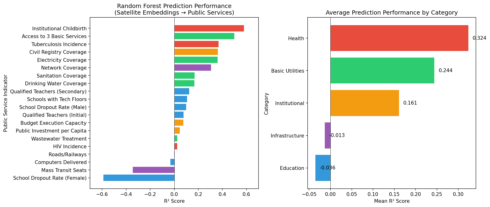

## Overview

**Research Question:** Can satellite imagery embeddings predict public service indicators at the municipal level in Bolivia?

::: {.incremental}
- **Data:** 339 Bolivian municipalities
- **Predictors:** 64 satellite embedding features (A00-A63)
- **Targets:** 20 public service indicators across 5 categories
- **Method:** Random Forest Regression
:::

## Data Sources

| Dataset | Description |
|---------|-------------|
| Satellite Embeddings | 64-dimensional feature vectors from 2017 satellite imagery |
| SDG Variables | Public service indicators aligned with UN SDGs |
| Coverage | 339 municipalities across 9 departments |

::: {.notes}
Data streamed from GitHub: quarcs-lab/ds4bolivia
:::

## Categories of Public Services

::: {.columns}
::: {.column width="50%"}
**Basic Utilities (5)**

- Access to 3 Basic Services
- Drinking Water Coverage
- Sanitation Coverage
- Wastewater Treatment
- Electricity Coverage

**Health (3)**

- Institutional Childbirth
- Tuberculosis Incidence
- HIV Incidence
:::

::: {.column width="50%"}
**Education (6)**

- Qualified Teachers
- School Dropout Rates
- Tech Infrastructure

**Infrastructure (3)**

- Network Coverage
- Mass Transit
- Roads/Railways

**Institutional (3)**

- Budget Execution
- Civil Registry
- Public Investment
:::
:::

## Model Performance by Category

{fig-align="center" width="100%"}

## Key Results: Best Predicted Variables

Variables with **R² > 0.30** (good predictability):

| Variable | Description | R² | Category |
|----------|-------------|-----|----------|
| sdg3_1_idca | Institutional Childbirth | **0.579** | Health |
| sdg1_4_abs | Access to 3 Basic Services | **0.499** | Basic Utilities |
| sdg3_3_ti | Tuberculosis Incidence | **0.368** | Health |
| sdg16_9_cr | Civil Registry Coverage | **0.362** | Institutional |
| sdg7_1_ec | Electricity Coverage | **0.361** | Basic Utilities |
| sdg9_c_mnc | Network Coverage | **0.306** | Infrastructure |

## Best Predicted: Institutional Childbirth {.smaller}

**R² = 0.579** (highest predictability)

::: {.columns}
::: {.column width="60%"}
**How it's measured:**

- Percentage of births occurring in hospitals/clinics
- Average from 2008-2012
- Unit: % of total births

**Why satellite imagery predicts it well:**

- Correlates with urbanization patterns
- Proximity to health facilities visible in imagery
- Infrastructure density indicators
:::

::: {.column width="40%"}
```
RMSE: 14.64
MAE:  10.91
N:    339
```
:::
:::

## Second Best: Access to Basic Services {.smaller}

**R² = 0.499**

::: {.columns}
::: {.column width="60%"}
**How it's measured:**

- % of households with access to water, sanitation, and electricity
- Census 2012
- Composite indicator

**Why satellite imagery predicts it well:**

- Building density and quality visible
- Urban vs rural patterns
- Infrastructure presence detectable
:::

::: {.column width="40%"}
```
RMSE: 18.13
MAE:  13.65
N:    339
```
:::
:::

## Poorly Predicted Variables

Variables with **R² < 0** (worse than baseline):

| Variable | Description | R² | Category |
|----------|-------------|-----|----------|
| sdg4_1_ssdrf | School Dropout (Female) | **-0.588** | Education |
| sdg11_2_samt | Mass Transit Seats | **-0.346** | Infrastructure |
| sdg9_5_cd | Computers Delivered | **-0.032** | Education |
| sdg9_1_routes | Roads/Railways | **-0.001** | Infrastructure |

::: {.fragment}
**Common pattern:** Administrative/policy variables not spatially correlated
:::

## Category Summary

| Category | Mean R² | Best Variable | Worst Variable |
|----------|---------|---------------|----------------|
| **Health** | 0.324 | Institutional Childbirth (0.58) | HIV Incidence (0.02) |
| **Basic Utilities** | 0.244 | Access to 3 Services (0.50) | Wastewater (0.02) |
| **Institutional** | 0.161 | Civil Registry (0.36) | Public Investment (0.05) |
| **Infrastructure** | -0.013 | Network Coverage (0.31) | Mass Transit (-0.35) |
| **Education** | -0.036 | Teachers Secondary (0.12) | Dropout Female (-0.59) |

## Key Insights

::: {.incremental}
1. **Health & Basic Utilities** are best predicted by satellite imagery
   - These reflect visible infrastructure and urbanization

2. **Education indicators** are poorly predicted
   - School quality and dropout rates depend on policy, not geography

3. **Infrastructure** is mixed
   - Network coverage (visible towers) vs Mass transit (policy-driven)

4. **Spatial correlation matters**
   - Variables with strong urban-rural gradients are more predictable
:::

## Implications

::: {.columns}
::: {.column width="50%"}
**For Researchers:**

- Satellite embeddings useful for infrastructure-related indicators
- Complement with survey data for policy-dependent variables
- Consider spatial autocorrelation in analysis
:::

::: {.column width="50%"}
**For Policymakers:**

- Satellite monitoring viable for basic service coverage
- Health facility access can be estimated remotely
- Education outcomes require direct measurement
:::
:::

## Methodology Notes

**Random Forest Configuration:**

- `n_estimators`: 100
- `max_depth`: 10
- `test_size`: 20%
- `random_state`: 42

**Evaluation Metrics:**

- R² (coefficient of determination)
- RMSE (root mean squared error)
- MAE (mean absolute error)

## Data & Code Availability

**Data Repository:**

- [github.com/quarcs-lab/ds4bolivia](https://github.com/quarcs-lab/ds4bolivia)

**Analysis Code:**

- `code/03_rf_public_services.py`

**Results:**

- `output/rf_public_services_results.csv`
- `output/rf_public_services_comparison.png`

## Thank You {.center}

**Questions?**

::: {.columns}
::: {.column width="50%"}
**Contact:**

Carlos Mendez
:::

::: {.column width="50%"}
**Project:**

claude4data
:::
:::
