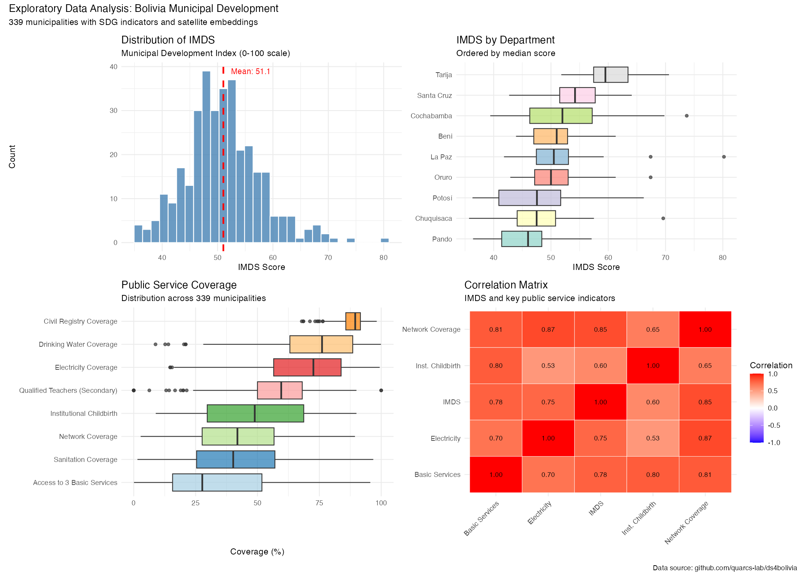

## Overview

**Dataset:** Bolivia's Municipal Development Indicators

::: {.incremental}
- **339 municipalities** across 9 departments
- **152 variables** total
- **Data sources:**
  - SDG indicators (development outcomes)
  - Satellite embeddings (64 features from 2017 imagery)
  - Administrative metadata
:::

## Data Structure

| Category | Count | Examples |
|----------|-------|----------|
| Administrative | 4 | Municipality name, department |
| SDG Indices | 18 | IMDS, index_sdg1-17 |
| SDG Variables | 66 | Public services, health, education |
| Satellite Embeddings | 64 | A00-A63 (image features) |

**Total: 152 variables**

## IMDS: Municipal Development Index

**Overall Statistics:**

| Statistic | Value |
|-----------|-------|
| N | 339 |
| Mean | 51.05 |
| Std Dev | 6.77 |
| Min | 35.70 |
| Median | 50.50 |
| Max | 80.20 |

::: {.fragment}
The distribution is roughly symmetric with slight right skew.
:::

## IMDS by Department {.smaller}

| Department | N | Mean | SD | Min | Median | Max |
|------------|---|------|-----|-----|--------|-----|
| Tarija | 11 | 60.6 | 5.5 | 51.8 | 59.5 | 70.6 |
| Santa Cruz | 56 | 54.3 | 4.8 | 42.7 | 54.2 | 64.1 |
| Cochabamba | 47 | 52.5 | 8.5 | 39.4 | 52.0 | 73.7 |
| La Paz | 87 | 51.0 | 5.4 | 41.8 | 50.5 | 80.2 |
| Oruro | 35 | 50.7 | 5.0 | 42.9 | 50.0 | 67.4 |
| Beni | 19 | 50.5 | 4.5 | 43.9 | 51.0 | 61.3 |
| Chuquisaca | 29 | 47.8 | 6.6 | 35.7 | 47.5 | 69.6 |
| Potosi | 40 | 47.4 | 7.6 | 36.3 | 47.6 | 66.2 |
| Pando | 15 | 45.4 | 5.6 | 36.4 | 46.0 | 57.1 |

## IMDS: Key Findings

::: {.columns}
::: {.column width="50%"}
**Highest Development:**

- Tarija (60.6)
- Santa Cruz (54.3)
- Cochabamba (52.5)

*Eastern lowlands and southern regions*
:::

::: {.column width="50%"}
**Lowest Development:**

- Pando (45.4)
- Potosi (47.4)
- Chuquisaca (47.8)

*Northern Amazon and highland mining regions*
:::
:::

::: {.fragment}
**Gap:** 15.2 points between highest and lowest department means
:::

## Public Service Indicators {.smaller}

| Variable | Description | Mean | SD | Min | Max |
|----------|-------------|------|-----|-----|-----|
| sdg16_9_cr | Civil Registry | 88.4 | 5.1 | 67.9 | 98.2 |
| sdg6_1_dwc | Drinking Water | 73.6 | 18.3 | 8.8 | 99.9 |
| sdg7_1_ec | Electricity | 69.3 | 18.6 | 14.7 | 99.4 |
| sdg4_c_qts | Qualified Teachers | 57.4 | 16.5 | 0.0 | 100.0 |
| sdg3_1_idca | Institutional Birth | 49.4 | 21.8 | 8.9 | 90.0 |
| sdg9_c_mnc | Network Coverage | 43.1 | 18.9 | 2.8 | 89.4 |
| sdg6_2_sc | Sanitation | 41.9 | 21.8 | 1.5 | 96.8 |
| sdg1_4_abs | 3 Basic Services | 34.4 | 24.0 | 0.1 | 95.6 |

## Public Services: Key Patterns

::: {.columns}
::: {.column width="50%"}
**High Coverage (>70%):**

- Civil Registry: 88.4%
- Drinking Water: 73.6%

*Administrative and water services well-established*
:::

::: {.column width="50%"}
**Low Coverage (<50%):**

- Network Coverage: 43.1%
- Sanitation: 41.9%
- 3 Basic Services: 34.4%

*Infrastructure gaps remain*
:::
:::

::: {.fragment}
**High variability** in most indicators (SD = 16-24%)
:::

## Public Services: Inequality

**Range Analysis:**

| Indicator | Min | Max | Range |
|-----------|-----|-----|-------|
| Drinking Water | 8.8% | 99.9% | 91.1 |
| 3 Basic Services | 0.1% | 95.6% | 95.5 |
| Sanitation | 1.5% | 96.8% | 95.3 |
| Electricity | 14.7% | 99.4% | 84.7 |

::: {.fragment}
**Large within-country disparities** in basic service access
:::

## Satellite Embeddings Overview

**64 features extracted from 2017 satellite imagery**

| Statistic | Value |
|-----------|-------|
| Features | 64 (A00-A63) |
| Overall Mean | -0.022 |
| Overall SD | 0.106 |
| Range | [-0.358, 0.377] |

::: {.fragment}
Features are roughly centered around zero with moderate variance.
:::

## Top Embedding Features by Variance

| Rank | Feature | Variance |
|------|---------|----------|
| 1 | A07 | 0.0199 |
| 2 | A23 | 0.0192 |
| 3 | A58 | 0.0158 |
| 4 | A61 | 0.0109 |
| 5 | A04 | 0.0108 |
| 6 | A54 | 0.0107 |
| 7 | A62 | 0.0105 |
| 8 | A35 | 0.0101 |
| 9 | A11 | 0.0096 |
| 10 | A31 | 0.0094 |

## Why Variance Matters

::: {.incremental}
- **High variance features** capture more spatial variation
- Features A07 and A23 show most differentiation across municipalities
- These may correspond to:
  - Urban vs rural patterns
  - Vegetation indices
  - Built environment density
- **Useful for predictive modeling** of development outcomes
:::

## Visualization: IMDS Distribution

{fig-align="center" width="90%"}

## EDA Summary

::: {.columns}
::: {.column width="50%"}
**Development Patterns:**

- Mean IMDS: 51.05
- Tarija leads (60.6)
- Pando trails (45.4)
- 15-point gap between extremes
:::

::: {.column width="50%"}
**Service Coverage:**

- Civil Registry: 88% (highest)
- Basic Services: 34% (lowest)
- Large within-country inequality
:::
:::

## Implications for Analysis

::: {.incremental}
1. **Significant variation** exists across municipalities
   - Enables predictive modeling

2. **Satellite embeddings** provide 64 features
   - Potential to predict development outcomes

3. **Service coverage gaps** are substantial
   - Policy-relevant variation to explain

4. **Department-level patterns** suggest regional factors
   - Geography may correlate with outcomes
:::

## Next Steps

::: {.incremental}
1. **Correlation analysis** between embeddings and outcomes
2. **Random Forest models** to predict public services
3. **Feature importance** to identify key satellite signals
4. **Spatial visualization** of predictions vs actual
:::

## Data Source

**Repository:** [github.com/quarcs-lab/ds4bolivia](https://github.com/quarcs-lab/ds4bolivia)

**Variables:**

- 339 Bolivian municipalities
- SDG indicators (2012-2017)
- Satellite embeddings (2017)

**Analysis Code:** `code/01_eda.R`

## Thank You {.center}

**Questions?**

::: {.columns}
::: {.column width="50%"}
**Contact:**

Carlos Mendez
:::

::: {.column width="50%"}
**Project:**

claude4data
:::
:::
