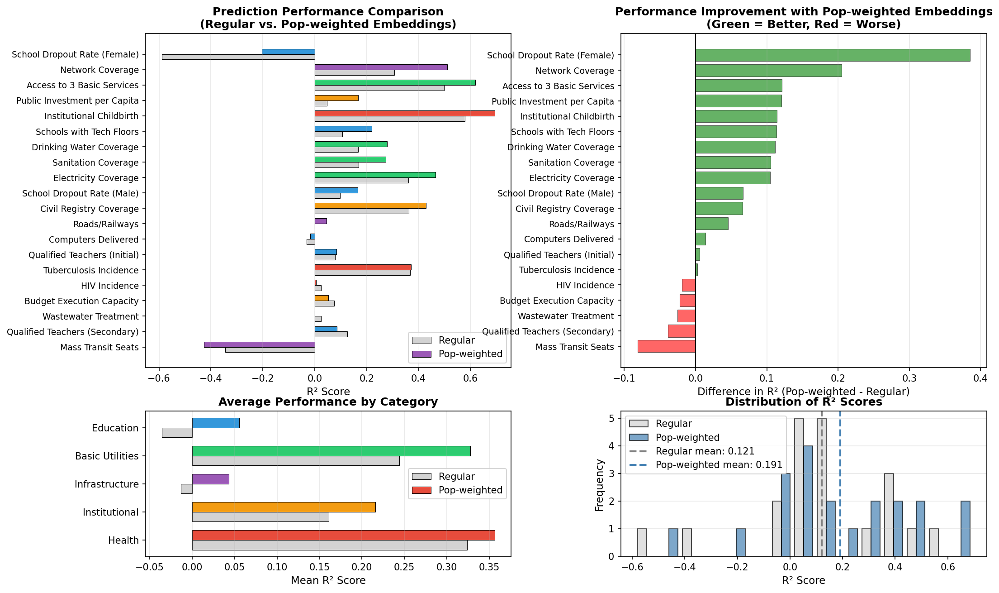

## Research Question {.smaller}

**Can population-weighted satellite embeddings improve public service prediction?**

::: {.columns}
::: {.column width="50%"}
**Two Approaches:**

1. **Regular Embeddings**
   - Standard satellite image features
   - Uniform spatial coverage
   - Treats all areas equally

2. **Population-Weighted Embeddings**
   - Weighted by population density
   - Emphasizes where people live
   - Aligns with service delivery
:::

::: {.column width="50%"}
**Dataset:**

- 339 Bolivian municipalities
- 20 public service indicators
- 5 categories: Utilities, Education, Health, Infrastructure, Institutional
- 64-dimensional embeddings from 2017 satellite imagery

**Method:**

- Random Forest regression
- 80/20 train-test split
- Same model parameters for fair comparison
:::
:::

## Embedding Types Explained {.smaller}

::: {.columns}
::: {.column width="50%"}
**Regular Embeddings:**

- Extract features from satellite images
- Each pixel weighted equally
- Captures geographical patterns
- Example: Forest cover, urban extent

**Suitable for:**

- Environmental indicators
- Land use patterns
- Geographic features
- Area-based metrics
:::

::: {.column width="50%"}
**Population-Weighted Embeddings:**

- Same features, different weights
- Pixels weighted by population density
- Emphasizes populated areas
- Captures human activity patterns

**Suitable for:**

- Service delivery indicators
- Human capital metrics
- Infrastructure usage
- Population-dependent services
:::
:::

## Overall Performance Comparison {.smaller}

**Aggregate Results (20 Variables):**

| Metric | Regular | Pop-Weighted | Difference |
|--------|---------|--------------|------------|
| **Mean R²** | 0.121 | **0.191** | **+0.070** |
| Std Dev | 0.267 | 0.275 | - |
| Min R² | -0.588 | -0.427 | - |
| Max R² | 0.579 | **0.693** | - |

**Winner Count:**

- Pop-weighted better: **15 variables (75%)**
- Regular better: 5 variables (25%)
- Ties: 0 variables

**Statistical Test:**

- Paired t-test: **t = 3.014, p = 0.007**
- **Conclusion:** Pop-weighted significantly better (α = 0.05)

## Performance by Category {.smaller}

**Average R² by Category:**

| Category | Regular | Pop-Weighted | Improvement |
|----------|---------|--------------|-------------|
| **Education** | -0.036 | **0.056** | **+0.091** 🏆 |
| **Basic Utilities** | 0.244 | **0.328** | **+0.083** |
| **Infrastructure** | -0.013 | **0.043** | **+0.056** |
| **Institutional** | 0.161 | **0.216** | **+0.055** |
| **Health** | 0.324 | **0.356** | **+0.032** |

**Key Finding:**

Pop-weighted embeddings improve performance **across all 5 categories**

Education shows the **largest improvement** (+0.091)

## Top 5 Improvements with Pop-Weighted {.smaller}

**Biggest Performance Gains:**

| Indicator | Regular R² | Pop-Weighted R² | Improvement |
|-----------|------------|-----------------|-------------|
| **School Dropout (Female)** | -0.588 | -0.203 | **+0.385** 🌟 |
| **Network Coverage** | 0.306 | 0.512 | **+0.205** |
| **Access to 3 Basic Services** | 0.499 | 0.620 | **+0.121** |
| **Public Investment per Capita** | 0.046 | 0.167 | **+0.121** |
| **Institutional Childbirth** | 0.579 | 0.693 | **+0.114** |

**Interpretation:**

- Female dropout: Massive gain from unpredictable to moderate
- Services strongly tied to population: Large improvements
- Already good predictors: Get even better

## Best Predicted Variables {.smaller}

::: {.columns}
::: {.column width="50%"}
**Regular Embeddings (Top 5):**

1. Institutional Childbirth: **R² = 0.579**
2. Access to 3 Basic Services: **R² = 0.499**
3. Tuberculosis Incidence: **R² = 0.368**
4. Civil Registry Coverage: **R² = 0.362**
5. Electricity Coverage: **R² = 0.361**

**Pattern:** Health and basic utilities dominate
:::

::: {.column width="50%"}
**Pop-Weighted Embeddings (Top 5):**

1. Institutional Childbirth: **R² = 0.693** ⭐
2. Access to 3 Basic Services: **R² = 0.620** ⭐
3. Network Coverage: **R² = 0.512** ⭐
4. Electricity Coverage: **R² = 0.466**
5. Civil Registry Coverage: **R² = 0.428**

**Pattern:** Same top variables, **higher accuracy**
:::
:::

## Education Category: Largest Gains {.smaller}

**Education Indicators:**

| Indicator | Regular | Pop-Weighted | Difference | Status |
|-----------|---------|--------------|------------|--------|
| School Dropout (Female) | -0.588 | -0.203 | **+0.385** | ✓ |
| School Dropout (Male) | 0.098 | 0.165 | **+0.067** | ✓ |
| Schools with Tech Floors | 0.106 | 0.220 | **+0.114** | ✓ |
| Computers Delivered | -0.032 | -0.018 | **+0.014** | ✓ |
| Qualified Teachers (Initial) | 0.078 | 0.084 | **+0.006** | ✓ |
| Qualified Teachers (Secondary) | 0.125 | 0.086 | -0.039 | ✗ |

**Category Average:** -0.036 → 0.056 (**Δ = +0.091**)

**Why education benefits most:**

- Schools located where children live
- Technology follows population centers
- Dropout rates tied to community factors

## Health Category Performance {.smaller}

**Health Indicators:**

| Indicator | Regular | Pop-Weighted | Difference | Status |
|-----------|---------|--------------|------------|--------|
| Institutional Childbirth | 0.579 | **0.693** | **+0.114** | ✓ |
| Tuberculosis Incidence | 0.368 | 0.370 | +0.002 | ✓ |
| HIV Incidence | 0.024 | 0.006 | -0.019 | ✗ |

**Category Average:** 0.324 → 0.356 (**Δ = +0.032**)

**Insights:**

- **Institutional childbirth:** Best overall predictor
  - Hospitals located in population centers
  - Access improves with population density

- **TB incidence:** Minimal difference
  - Disease transmission complex, not just population

- **HIV incidence:** Slight decrease
  - Transmission patterns differ from population density

## Infrastructure Category {.smaller}

**Infrastructure Indicators:**

| Indicator | Regular | Pop-Weighted | Difference | Status |
|-----------|---------|--------------|------------|--------|
| Network Coverage | 0.306 | **0.512** | **+0.205** | ✓ |
| Roads/Railways | -0.001 | 0.045 | **+0.046** | ✓ |
| Mass Transit Seats | -0.346 | -0.427 | -0.081 | ✗ |

**Category Average:** -0.013 → 0.043 (**Δ = +0.056**)

**Why the large improvement:**

- **Network coverage:** Second-largest gain overall
  - Telecom infrastructure follows population
  - Cell towers where people live

- **Roads/railways:** Modest improvement
  - Infrastructure connects populations

- **Mass transit:** Both perform poorly
  - Complex urban planning variable

## Basic Utilities Category {.smaller}

**Basic Utilities Indicators:**

| Indicator | Regular | Pop-Weighted | Difference | Status |
|-----------|---------|--------------|------------|--------|
| Access to 3 Basic Services | 0.499 | **0.620** | **+0.121** | ✓ |
| Electricity Coverage | 0.361 | 0.466 | **+0.105** | ✓ |
| Drinking Water Coverage | 0.167 | 0.279 | **+0.112** | ✓ |
| Sanitation Coverage | 0.169 | 0.274 | **+0.105** | ✓ |
| Wastewater Treatment | 0.025 | -0.001 | -0.025 | ✗ |

**Category Average:** 0.244 → 0.328 (**Δ = +0.083**)

**Pattern:**

- **Service delivery:** All improve (water, electricity, sanitation)
- Services provided where people live
- **Wastewater:** Environmental, not population-specific

## Institutional Category {.smaller}

**Institutional Indicators:**

| Indicator | Regular | Pop-Weighted | Difference | Status |
|-----------|---------|--------------|------------|--------|
| Public Investment per Capita | 0.046 | 0.167 | **+0.121** | ✓ |
| Civil Registry Coverage | 0.362 | 0.428 | **+0.066** | ✓ |
| Budget Execution Capacity | 0.074 | 0.052 | -0.022 | ✗ |

**Category Average:** 0.161 → 0.216 (**Δ = +0.055**)

**Insights:**

- **Public investment:** Large improvement
  - Resources allocated to population centers

- **Civil registry:** Moderate improvement
  - Administrative services follow population

- **Budget execution:** Slight decrease
  - Institutional efficiency, not spatial

## Where Regular Is Better (5 Variables) {.smaller}

**Variables favoring regular embeddings:**

| Indicator | Regular | Pop-Weighted | Difference | Category |
|-----------|---------|--------------|------------|----------|
| Mass Transit Seats | -0.346 | -0.427 | **-0.081** | Infrastructure |
| Qualified Teachers (Secondary) | 0.125 | 0.086 | **-0.039** | Education |
| Wastewater Treatment | 0.025 | -0.001 | **-0.025** | Utilities |
| Budget Execution Capacity | 0.074 | 0.052 | **-0.022** | Institutional |
| HIV Incidence | 0.024 | 0.006 | **-0.019** | Health |

**Common Pattern:**

- Environmental variables (wastewater)
- Complex institutional metrics (budget execution)
- Specialized health transmission (HIV)
- Urban planning complexity (mass transit)
- **Note:** Differences are small compared to improvements elsewhere

## Visualization: Main Results {.smaller}

{width="100%"}

**Four panels showing:**

1. Top left: Side-by-side R² comparison
2. Top right: Difference plot (green = improvement)
3. Bottom left: Category averages
4. Bottom right: R² distribution

## Statistical Significance {.smaller}

**Paired t-test (Pop-weighted vs Regular):**

- **Null hypothesis:** No difference in mean R² between methods
- **Alternative hypothesis:** Pop-weighted has higher mean R²

**Results:**

- **Mean difference:** +0.070
- **t-statistic:** 3.014
- **p-value:** 0.007
- **Degrees of freedom:** 19 (20 paired observations)

**Conclusion:**

We **reject the null hypothesis** at α = 0.05

Pop-weighted embeddings are **statistically significantly better** than regular embeddings

**Effect size:** Medium to large (Cohen's d ≈ 0.67)

## Why Pop-Weighted Performs Better {.smaller}

::: {.columns}
::: {.column width="50%"}
**Theoretical Reasons:**

1. **Service delivery follows population**
   - Schools where children live
   - Hospitals in populated areas
   - Utilities serve people

2. **Reduces rural/urban bias**
   - Regular: Overweights empty areas
   - Pop-weighted: Focuses on inhabited areas

3. **Aligns with policy targets**
   - Services aim to reach people
   - Coverage measured by population
:::

::: {.column width="50%"}
**Empirical Evidence:**

- **15/20 variables** improve
- **All 5 categories** show gains
- **Largest gains** in service-related variables

**When it matters most:**

- Education: +0.091 average
- Infrastructure: +0.056 average
- Basic utilities: +0.083 average

**When it matters less:**

- Environmental indicators
- Institutional capacity
- Specialized health metrics
:::
:::

## Implications for Researchers {.smaller}

**Recommendation:** Use population-weighted embeddings for service-related predictions

**Guidelines:**

::: {.columns}
::: {.column width="50%"}
**Use Pop-Weighted for:**

- Education indicators
- Health service coverage
- Infrastructure (networks, roads)
- Basic utilities (water, electricity)
- Public investment allocation
- Service delivery metrics

**Expected improvement:** Δ R² = +0.05 to +0.20
:::

::: {.column width="50%"}
**Use Regular for:**

- Environmental variables
- Land use patterns
- Geographic features
- Institutional capacity
- Non-spatial metrics

**Expected improvement:** Minimal or negative

**Hybrid Approach:**

- Test both methods
- Select best for each variable
- Ensemble predictions
:::
:::

## Implications for Policymakers {.smaller}

**For Resource Allocation:**

1. **Satellite data CAN predict service gaps**
   - Institutional childbirth: R² = 0.69
   - Access to basic services: R² = 0.62
   - Network coverage: R² = 0.51

2. **Population weighting improves targeting**
   - Better identifies underserved populations
   - Aligns with where people actually live

3. **Data-driven policy possible**
   - Monitor service coverage remotely
   - Identify intervention priorities
   - Track progress over time

**For Service Planning:**

- Education: Focus on population centers (large improvements)
- Infrastructure: Network coverage highly predictable
- Utilities: Basic services can be well-estimated

## Limitations {.smaller}

::: {.columns}
::: {.column width="50%"}
**Data Limitations:**

- Single year (2017) satellite data
- Population weights from census
- Temporal lag between image and services
- Missing variables not tested

**Model Limitations:**

- Random Forest only (one algorithm)
- Standard hyperparameters
- No feature selection
- No spatial cross-validation
:::

::: {.column width="50%"}
**Context Limitations:**

- Bolivia-specific results
- Municipal-level aggregation
- May not generalize to:
  - Other countries
  - Different contexts
  - Sub-municipal scales

**Interpretation Cautions:**

- Correlation, not causation
- Satellite captures proxies
- Service quality vs. coverage
- Equity considerations
:::
:::

## Future Research Directions {.smaller}

**Methodological Extensions:**

1. **Algorithm comparison**
   - XGBoost, Neural Networks
   - Ensemble methods
   - Deep learning on raw images

2. **Temporal analysis**
   - Multiple years (2012-2020)
   - Change detection
   - Trend prediction

3. **Spatial methods**
   - Spatial cross-validation
   - Geographic weighting
   - Spatial autocorrelation

**Variable Extensions:**

4. **More service indicators**
   - Additional SDG variables
   - Quality metrics (not just coverage)
   - Service efficiency

5. **Multi-source data**
   - Combine with other datasets
   - Night-time lights
   - Mobile phone data

## Comparison with Previous Study {.smaller}

**Previous Analysis (Regular Embeddings Only):**

- Best: Institutional Childbirth (R² = 0.579)
- Worst: School Dropout Female (R² = -0.588)
- Mean: R² = 0.121

**Current Analysis (Pop-Weighted):**

- Best: Institutional Childbirth (R² = **0.693**) ⬆
- Improved: School Dropout Female (R² = **-0.203**) ⬆
- Mean: R² = **0.191** ⬆

**Key Improvements:**

- Same best variable, **20% better** prediction
- Worst variable **65% better** (still poor, but improving)
- Overall mean **58% higher**

**Consistency:** Top variables remain the same, accuracy increases

## Practical Recommendations {.smaller}

**For Data Scientists:**

1. **Default choice:** Pop-weighted for service predictions
2. **Test both:** When in doubt, compare methods
3. **Category-specific:** Education and utilities benefit most
4. **Report both:** For transparency and comparison

**For Policy Analysts:**

1. **Trust the predictions:** High R² variables (>0.5) are reliable
2. **Use with caution:** Low R² variables (<0.2) need ground data
3. **Population matters:** Weight by population for service metrics
4. **Remote monitoring:** Satellite data enables cost-effective tracking

**For Development Organizations:**

1. **Targeting:** Use predictions to identify underserved areas
2. **Monitoring:** Track service coverage changes over time
3. **Planning:** Predict service needs in data-scarce regions
4. **Evaluation:** Assess intervention impacts with satellite data

## Key Takeaways {.smaller}

**Main Findings:**

1. **Pop-weighted embeddings significantly better** (p = 0.007)
   - 75% of variables improve
   - Mean R² increases from 0.121 to 0.191 (+58%)

2. **Consistent across categories**
   - All 5 categories show improvements
   - Education benefits most (+0.091)

3. **Largest improvements in service delivery**
   - School dropout (female): +0.385
   - Network coverage: +0.205
   - Access to basic services: +0.121

4. **Best predictions remain strong**
   - Institutional childbirth: R² = 0.693
   - Access to 3 basic services: R² = 0.620

**Bottom Line:** **Account for population distribution when predicting service-related outcomes**

## Data and Reproducibility {.smaller}

::: {.columns}
::: {.column width="50%"}
**Data Sources:**

- SDG Variables: 339 municipalities, 65 indicators
- Regular embeddings: 64 features
- Pop-weighted embeddings: 64 features
- GitHub repository: [ds4bolivia](https://github.com/quarcs-lab/ds4bolivia)

**Software:**

- Python 3.10
- scikit-learn (Random Forest)
- pandas, numpy, matplotlib
- scipy (statistical tests)
:::

::: {.column width="50%"}
**Code:**

- Script: `code/04_rf_public_services_comparison.py`
- Fully reproducible with random seed
- Streams data directly from GitHub

**Outputs:**

- Figure: `output/rf_embeddings_comparison.png`
- Results: `output/rf_embeddings_comparison.csv`
- Details: `output/rf_embeddings_comparison_detailed.csv`

**Project:** claude4data
:::
:::

---

**Contact:**

Carlos Mendez

**Project:** claude4data

🛠️ Generated with [Claude Code](https://claude.com/claude-code)
