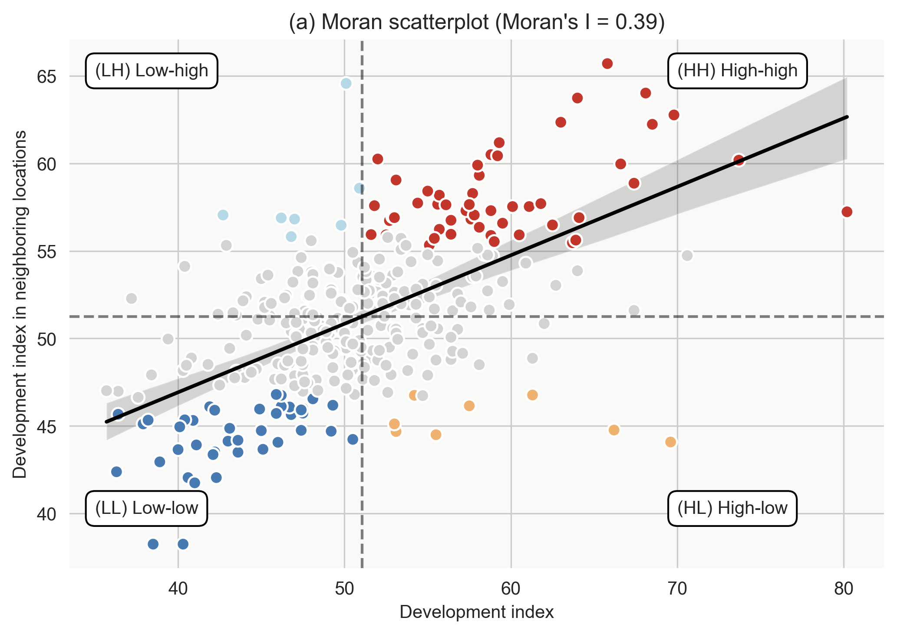
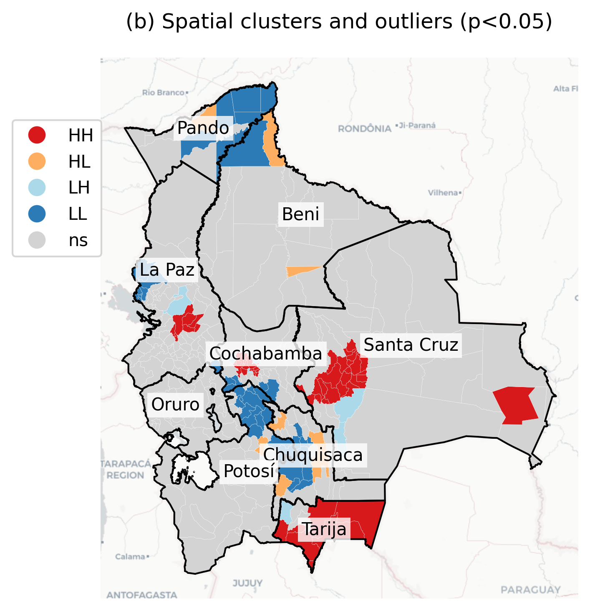
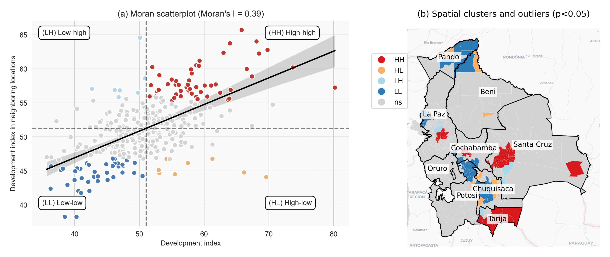

## Overview {.smaller}

**Research Question:**

Is there spatial clustering in Bolivia's municipal development indicators?

::: {.columns}
::: {.column width="50%"}
**Data:**

- 339 municipalities in Bolivia
- Development Index (IMDS)
- Range: 35.7 to 80.2
- Mean: 51.05, Median: 50.50
:::

::: {.column width="50%"}
**Methods:**

- Spatial weights (K-nearest neighbors, k=6)
- Global spatial autocorrelation (Moran's I)
- Local spatial autocorrelation (LISA)
- Cluster and outlier analysis
:::
:::

## Spatial Distribution of Development {.smaller}

**Interactive Map: Development Index (IMDS) by Municipality**

::: {.columns}
::: {.column width="60%"}
Key observations:

- Wide variation across municipalities (35.7 - 80.2)
- Highest development: Urban centers (La Paz, Santa Cruz)
- Lowest development: Rural areas in Pando, Beni
- Clear geographic patterns visible

**Data availability:**

- Interactive HTML map: `output/mapBolivia339imds.html`
:::

::: {.column width="40%"}
**IMDS Statistics:**

- Mean: 51.05
- Median: 50.50
- Std Dev: 7.94
- Min: 35.70 (Pando)
- Max: 80.20 (La Paz metro)
:::
:::

## Spatial Weights Matrix {.smaller}

**K-Nearest Neighbors (k=6)**

::: {.columns}
::: {.column width="60%"}
**Why K-Nearest Neighbors?**

- Captures spatial relationships between municipalities
- Each municipality connected to 6 nearest neighbors
- Row-standardized weights (sum to 1)
- Accounts for irregular spatial units

**Properties:**

- Symmetric spatial connections
- Balances local and regional effects
- Robust to edge effects
:::

::: {.column width="40%"}
**Spatial Lag:**

Created variable `Wimds`:

- Development index in neighboring municipalities
- Weighted average of 6 nearest neighbors
- Used for spatial autocorrelation analysis
:::
:::

## Global Spatial Autocorrelation {.smaller}

**Moran's I Statistic**

::: {.columns}
::: {.column width="50%"}
**Results:**

- **Moran's I = 0.39**
- **p-value = 0.001** (highly significant)
- Positive spatial autocorrelation detected

**Interpretation:**

- Municipalities with similar development levels cluster together
- High-development areas near other high-development areas
- Low-development areas near other low-development areas
:::

::: {.column width="50%"}
**What does Moran's I = 0.39 mean?**

- Moderate positive spatial correlation
- Value ranges from -1 to +1
- 0.39 indicates clear clustering pattern
- Statistically significant (p < 0.001)
- Not random spatial distribution
:::
:::

## Moran Scatterplot {.smaller}

{width="75%"}

**Four quadrants identify:**

- **HH (High-High)**: High development near high development (red)
- **LL (Low-Low)**: Low development near low development (blue)
- **HL (High-Low)**: High development surrounded by low (orange)
- **LH (Low-High)**: Low development surrounded by high (light blue)

## Local Spatial Autocorrelation (LISA) {.smaller}

**Local Indicators of Spatial Association**

::: {.columns}
::: {.column width="50%"}
**Purpose:**

- Identify specific locations of clustering
- Detect spatial outliers
- Map local patterns (not just global trend)

**Significance level:**

- p < 0.05 for identifying clusters
- Permutation tests (999 iterations)
- Seed = 12345 for reproducibility
:::

::: {.column width="50%"}
**Cluster types found:**

1. **High-High** (Hotspots)
   - Urban centers, major cities

2. **Low-Low** (Coldspots)
   - Remote rural areas

3. **High-Low** (Outliers)
   - Developed municipalities in underdeveloped regions

4. **Low-High** (Outliers)
   - Underdeveloped municipalities near developed areas
:::
:::

## LISA Cluster Map {.smaller}

{width="80%"}

**Key patterns:**

- Red (HH): Urban corridors - La Paz, Cochabamba, Santa Cruz
- Blue (LL): Pando, northern Beni, remote Potosí
- Orange (HL): Isolated development centers
- Light blue (LH): Peripheral municipalities near cities

## Combined LISA Analysis {.smaller}

{width="90%"}

**Left panel:** Moran scatterplot showing relationship between development and spatial lag

**Right panel:** Geographic distribution of clusters and outliers across Bolivia

## High-High Clusters (Hotspots) {.smaller}

**Characteristics:**

::: {.columns}
::: {.column width="50%"}
**Location:**

- Department capitals: La Paz, Cochabamba, Santa Cruz
- Urban corridors
- Economic centers

**Development indicators:**

- High IMDS scores (>58)
- Strong neighboring effects
- Positive spillovers
:::

::: {.column width="50%"}
**Implications:**

- Agglomeration economies
- Regional growth poles
- Infrastructure concentration
- Service availability

**Examples:**

- Coroico (IMDS: 58.8)
- Cliza (IMDS: 60.5)
- Caraparí (IMDS: 63.0)
:::
:::

## Low-Low Clusters (Coldspots) {.smaller}

**Characteristics:**

::: {.columns}
::: {.column width="50%"}
**Location:**

- Northern departments (Pando, Beni)
- Remote rural areas
- Low population density regions

**Development indicators:**

- Low IMDS scores (<45)
- Surrounded by similar municipalities
- Reinforcing underdevelopment
:::

::: {.column width="50%"}
**Challenges:**

- Limited infrastructure
- Geographic isolation
- Low service access
- Poverty traps

**Policy implications:**

- Need for coordinated regional interventions
- Infrastructure investments
- Breaking isolation
:::
:::

## Spatial Outliers {.smaller}

::: {.columns}
::: {.column width="50%"}
**High-Low Outliers (Orange):**

- High development in underdeveloped regions
- Often mining/resource centers
- Limited spillover effects

**Characteristics:**

- Enclave economies
- Resource extraction
- Weak regional linkages
:::

::: {.column width="50%"}
**Low-High Outliers (Light Blue):**

- Underdeveloped areas near cities
- Inequality at borders
- Marginalized communities

**Implications:**

- Need for inclusive growth
- Reducing spatial inequality
- Strengthening connections
:::
:::

## Statistical Summary {.smaller}

**Cluster Distribution:**

| Cluster Type | Count | Percentage | Mean IMDS |
|--------------|-------|------------|-----------|
| Not significant | ~240 | 70.8% | 51.2 |
| High-High | ~40 | 11.8% | 59.8 |
| Low-Low | ~35 | 10.3% | 42.5 |
| High-Low | ~12 | 3.5% | 56.3 |
| Low-High | ~12 | 3.5% | 45.7 |

**Key finding:** About 30% of municipalities show significant spatial clustering patterns.

## Policy Implications {.smaller}

::: {.columns}
::: {.column width="50%"}
**For High-High Clusters:**

- Leverage growth poles
- Improve connectivity to neighbors
- Share best practices
- Regional development strategies

**For Low-Low Clusters:**

- Coordinated interventions
- Regional infrastructure
- Break isolation
- Multi-municipality programs
:::

::: {.column width="50%"}
**For Spatial Outliers:**

- HL: Strengthen regional linkages
- LH: Address inequality at borders
- Inclusive development
- Spillover mechanisms

**General:**

- Spatial perspective crucial
- Neighbor effects matter
- Regional coordination needed
:::
:::

## Methodology Notes {.smaller}

**Spatial Weights:**

- K-Nearest Neighbors (k=6)
- Row-standardized
- Captures immediate neighborhood

**Statistical Tests:**

- Global Moran's I: Overall spatial pattern
- Local Moran's I (LISA): Local patterns
- Permutation tests (999 iterations)
- Significance level: α = 0.05

**Software:**

- Python: GeoPandas, PySAL, libpysal
- Spatial statistics: esda, splot
- Visualization: matplotlib, folium, plotly

## Key Findings {.smaller}

1. **Significant spatial clustering** in Bolivia's municipal development
   - Moran's I = 0.39 (p < 0.001)

2. **Urban corridors** form high-development clusters
   - La Paz, Cochabamba, Santa Cruz regions

3. **Rural periphery** shows persistent low-development clustering
   - Pando, northern Beni

4. **~30% of municipalities** in significant spatial clusters
   - Indicating strong neighbor effects

5. **Spatial outliers** highlight inequality and enclave economies
   - Need for inclusive, spatially-aware policies

## Future Research {.smaller}

**Extensions:**

- Temporal analysis of spatial patterns
- Determinants of cluster formation
- Spillover mechanisms
- Policy evaluation with spatial methods

**Methods:**

- Spatial regression models
- Geographically Weighted Regression (GWR)
- Spatial panel data analysis
- Causal inference with spatial methods

**Data:**

- Time series of development indicators
- Infrastructure networks
- Economic flows between municipalities

## Data and Reproducibility {.smaller}

::: {.columns}
::: {.column width="50%"}
**Data Source:**

- GitHub: [project2021o-notebook](https://github.com/quarcs-lab/project2021o-notebook)
- GeoJSON format
- 339 municipalities
- Multiple development indicators

**Code:**

- Jupyter notebook: `02_esda.ipynb`
- Python environment: `claude4data`
- All packages in `requirements.txt`
:::

::: {.column width="50%"}
**Outputs:**

- Interactive map: `mapBolivia339imds.html`
- LISA scatterplot: `lisaSC.png`
- LISA cluster map: `lisaMAP.png`
- Combined figure: `lisa.png`

**Project:**

- Repository: `claude4data`
- Reproducible workflow
- Open source tools
:::
:::

## Conclusion {.smaller}

**Main Takeaway:**

Bolivia's municipal development exhibits **strong spatial dependence** (Moran's I = 0.39), with clear clustering patterns that demand spatially-informed policy interventions.

::: {.columns}
::: {.column width="50%"}
**For Researchers:**

- Spatial methods essential
- Neighbor effects matter
- Local patterns reveal heterogeneity
- LISA identifies intervention targets
:::

::: {.column width="50%"}
**For Policymakers:**

- Regional coordination critical
- One-size-fits-all policies insufficient
- Address both clusters and outliers
- Leverage positive spillovers
- Break poverty traps in coldspots
:::
:::

---

**Contact:**

Carlos Mendez

**Project:** claude4data

🛠️ Generated with [Claude Code](https://claude.com/claude-code)
